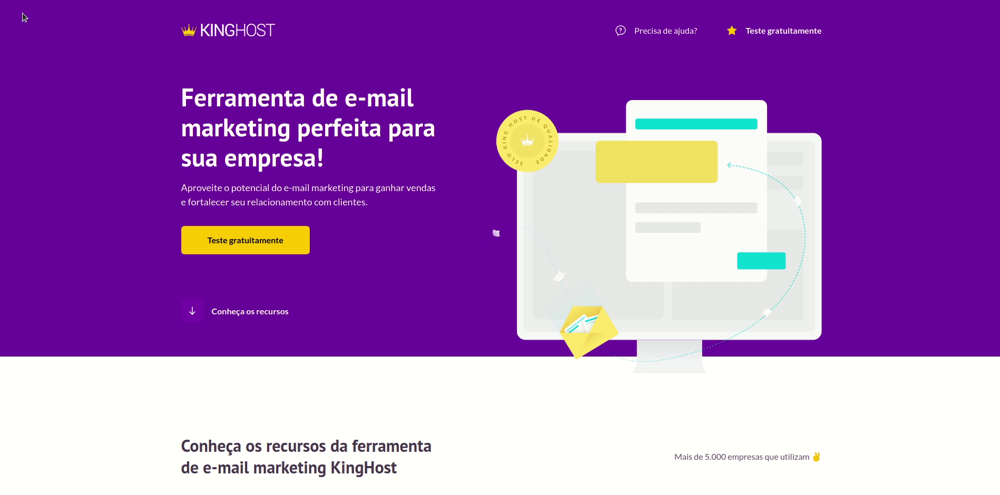

<h1 align="center">
    <a href="https://paulomvrech.github.io/kinghost-project/" target="_blank">Projeto Landing Page - KingHost</a>
</h1>

## 💻 Sobre o projeto
Landing Page desenvolvida em um dos módulos do curso **[Codeboost](https://codeboost.com.br/)**. 

Projeto construido utilizando o **[Pré-Processador SASS](https://sass-lang.com/)**.

Realizei o deploy deste projeto no Github Pages, **[clique aqui](https://paulomvrech.github.io/kinghost-project/)** para conferir.

---

## 👀 Demo
- Versão Desktop
<div align="center">
    
</div>

- Versão Mobile
<div align="center">
    
</div>


---

## 🚀 Tecnologias utilizadas

Esse projeto foi desenvolvido utilizando as seguintes tecnologias:

- HTML5
- CSS3
- SASS

---

## 🛠 Como executar o projeto em sua máquina

```bash

# Clone este repositório
$ git clone git@github.com:paulomvrech/kinghost-project.git

# Acesse a pasta do projeto no seu terminal/cmd
$ cd kinghost-project

# Execute o arquivo index.html em seu navegador


```

---

<p align="center">Desenvolvido por 👏 Paulo Muller Vrech</p>